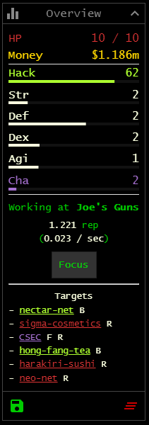

# Bitburner Scripts

These are scripts I use in the game Bitburner. Last version they were tested with is `v2.2.2`.  
Some of the scripts or functions used are not made by me but are marked as that.

## Hud Extended

Display a list of interesting Targets directly in the 'Overview' HUD window.  
Targets shown either:
- aren't rooted / hacked yet
- don't have a backdoor yet
- have contracts

Faction targets are highlighted in a special color.

Clicking on a target copies the connect command directly to the Terminal (if on the Terminal page). If the target is already rooted but does not have a backdoor yet, the backdoor command is directly appended to the connect command.
